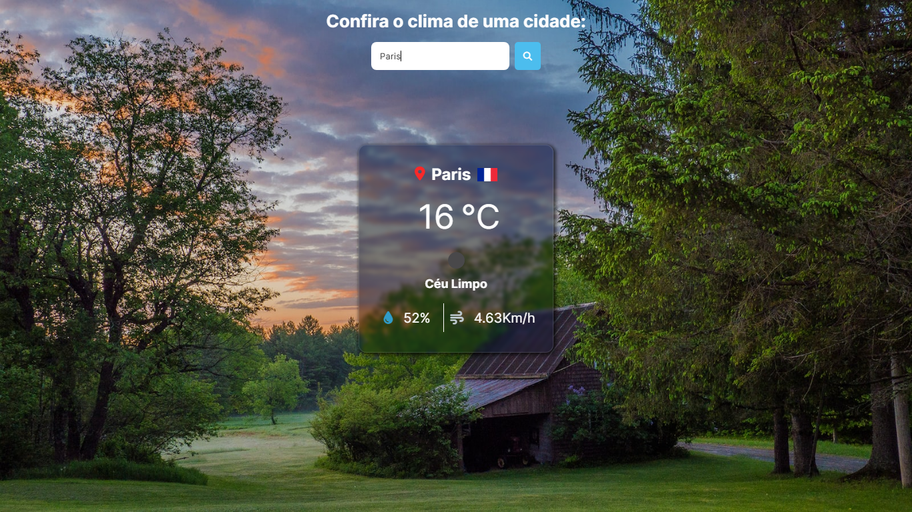

# Clima

   

> ## Sobre

Este projeto foi desenvolvido junto ao Matheus Battisti.   
Ao inserir o nome de uma cidade, aparece o clima do local.
 
> ## Tecnologias utilizadas

- HTML
- CSS
- JavaScript

> ## Contato

- [LinkedIn](https://www.linkedin.com/in/lucas-rodrigues-perfil/)
- [Portfólio](https://portfolio-lucasrodrigues.netlify.app/)